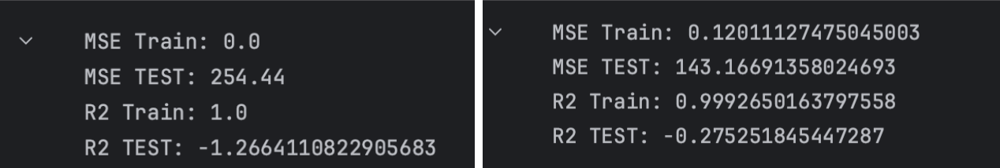

# CS 412 Course Project

## Project Introduction

This project is designed to develop a machine learning model capable of predicting students' homework grades by analyzing their conversations with ChatGPT. Our approach is rooted in the belief that these interactions can provide valuable insights into students' understanding and learning process.

## Development Process

The foundation of our project is based on a code template provided by our course’s teaching assistant. Our team has made significant enhancements to this template, tailoring it to better suit our project’s needs.

A key decision in our project was understanding the role of similarity between student prompts and homework questions. Initially, we considered basing our model primarily on these similarity scores. However, after thoughtful group discussions, we concluded that while these similarity scores are important, they should not be the sole focus of our model. Nevertheless, they have been incorporated as features within our training dataset, providing additional context to our model.

For our project, we decided to use a pre-trained model and chose the GloVe models, which are great for understanding word meanings and similarities. We downloaded three versions of GloVe: the 50-dimensional (50d), 100-dimensional (100d), and 200-dimensional (200d) models.
We tested each of these GloVe models in our project, making sure to keep everything else the same so we could see which GloVe model worked best. After trying them out, we found that the 100d and 200d models were too complex for our needs. They were causing our regression model to overfit. Overfitting is when a model learns too much from the training data, including the noise and details it shouldn't, and then it doesn't work well on new data.

So, we decided that the 50d model was the best choice for us. It was simpler than the other two, but it still did a good job of understanding the language patterns we needed. Additionally, considering the limited size of our training dataset, the 50d model was more appropriate for our situation. When working with a smaller dataset, using a model with lower dimensionality like the 50d can be advantageous. Models with higher dimensions, like the 100d and 200d, often require more data to learn effectively and avoid overfitting.

Here are the results with **Glove 100d** and **Glove 50d**, respectively:

Given that each student interacted with ChatGPT differently, asking a varying number of questions and prompts, we faced a challenge in standardizing these interactions into a consistent format for our model. Different students generated different amounts of data, and our task was to fit these varied data points into a uniform structure.

To handle this, we used the similarity scores between student prompts and the homework questions that have already been provided to us. For each prompt a student made, we identified the homework question it was most closely related to. This step was crucial in categorizing the prompts effectively. Once we mapped the prompts to their corresponding questions, we calculated the average vector for all prompts associated with each specific question. This process was applied to each student's set of prompts. Given that our project used 50-dimensional vectors for each prompt and there were 9 homework questions in total, this approach led us to a consistent feature set of 9 x 50 = 450 features for each student.

By computing these average vectors, we transformed the varying lengths of prompt interactions into a fixed-size feature set. This methodology not only maintained the integrity of the data but also allowed us to accommodate the diversity in students' interactions with ChatGPT, ensuring that each student's data contributed meaningfully to our model. Following the creation of our consistent 450-feature dataset for each student, we then focused on normalizing the data. To achieve this, we employed a Standard Scaler, a common technique used to standardize features by removing the mean and scaling to unit variance.

### Feature Engineering

Recognizing the varying importance of different homework questions, we decided to integrate the weight of each question's grade into our analysis. This decision was based on the rationale that a higher similarity with a question carrying more points should have a greater impact than similarity with a lower-weighted question.
To implement this, we calculated a weighted similarity score for each student. We began by multiplying the number of prompts a student asked about each question by the grade weight of that question. This meant that prompts related to a 20-point question were given more significance in our model than those related to a 5-point question. This weighting approach aligns the feature importance with the actual grading scheme of the homework, ensuring that our model captures the nuances of academic significance.
Following the weighting of prompts, we then incorporated the pre-provided similarity scores into our feature set.

As we keep experimenting with our machine learning model, we made an interesting discovery about some of the features we were using. Specifically, we found that the keyword search features that have been provided to us in the template code, which we thought would be useful, actually didn't add much to the model's performance. Our project uses a pre-trained language model called GloVe, which is really good at understanding language in a detailed and nuanced way. It looks at how words are used in context, going beyond just finding specific keywords. Because GloVe is so advanced, we started to see that the simpler keyword search features weren't necessary. Therefore, we decided to take these keyword search features out of our model training.

In the process of adding students' grades to our dataset, we noticed something important about these grades, which are our labels: most of them, 119 out of 123, were higher than 70. To make our model more effective, we decided to adjust these grades into a new range. We changed the grades to fit within a 0 to 30 scale. This step was about more than just changing numbers. It was a thoughtful strategy to deal with the issue of having too many high grades. By compressing the range of grades, we spread them out more evenly. This way, the model wouldn't be overwhelmed by a large number of similar high grades and could learn to predict more accurately.

After compressing the grades into a 0-30 scale, it was important to apply normalization again. This process ensures that both the features and the newly adjusted labels are on a consistent scale, enhancing the overall coherence and effectiveness of the model.

In the final stages of our project, we focused on experimenting with various regression algorithms to identify the one that offered the best mix of accuracy and performance. Our exploration included models like the Random Forest, PCR (Principal Component Regression), Lasso, and Ridge regressors. In addition to testing these individual models, we also ventured into creating an ensemble model. This approach combined the outputs of the aforementioned models, leveraging their collective strengths. We experimented with various combinations in this ensemble framework, analyzing how each blend performed in terms of key metrics like the R2 score and MSE (Mean Squared Error). After thorough testing and evaluation, we found that the Random Forest Regressor stood out as the most effective model for our needs.

## Group Details

### Group Members

- Enes Erkam Demirci

- Mehmet Enes Onuş

- Akif Işıtan

- Yaşar Ateş

- Emir Çolakbüyük

### Task Division

- Experiments and comparison of the glove models: Emir - Yaşar - Akif

- Fitting the model outputs to a dataframe: Erkam

- Feature Engineering (new features): Mehmet Enes

- New scaling for grades: Yaşar - Emir

- Experiments and comparison of the glove models: Everyone tried at least one combination

- Uploading the joblib models and preparation of the test file: Mehmet Enes - Akif - Erkam

- Report: Erkam - Mehmet Enes
